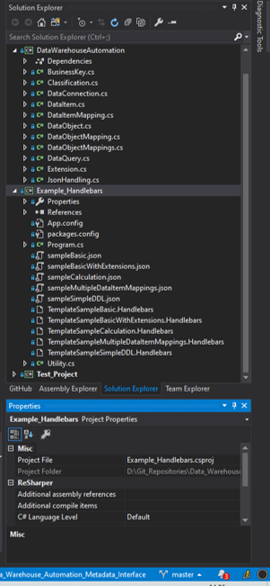

# Getting started

First and foremost, please refer to the GitHub on any work in progress including documentation and discussions. This page is meant to provide a brief introduction and help interested parties to get started generating their own code quickly - but the GitHub should always be the first go-to resources for questions, comments and suggestions.

## How can I use the schema?

The generic Data Warehouse Automation schema / interface definition ('schema') is at it's core a series of definitions of how metadata can be recorded.

The schema itself is found [here on GitHub](https://github.com/data-solution-automation-engine/data-warehouse-automation-metadata-schema).

In practice, it is a class library (Dynamic Link Library file - or DLL) called DataWarehouseAutomation.dll that can be referred to in projects or solutions and through which JSON metadata files can be validated and/or loaded into memory for further use.

For example, both TEAM and VDW make a reference to this library to read/write the JSON files.

In other words, the DataWarehouseAutomation library can be used to interface with the JSON metadata files that conform to the schema definition.

A screenshot of the GitHub contents in Visual Studio is provided here as well. In the screenshot, you can see the various defined classes belonging to the DataWarehouseAutomation.dll library.



Also visible is an 'Example_Handlebars' project which contains various working examples generating code for different use-cases.

## Generating code

One of the simplest ways to get started is to modify the Example_Handlebars project. This project uses the JSON.Net as well as the Handlebars.Net NuGet packages, as well as of course the DataWarehouseAutomation.dll library.

With these three components in place, code can be generated quickly using a simple Console application by pointing the paths to a JSON metadata input file (or files) and to a Handlebars pattern file.

Consider the snippet below, as taken from the example project:

```cs
// Load a template (pattern) from file
stringTemplate = File.ReadAllText(AppDomain.CurrentDomain.BaseDirectory + @"..\..\TemplateSampleBasic.handlebars");

// Compile the template
var template = Handlebars.Compile(stringTemplate);

// Load a metadata Json file into memory as a string
jsonInput = File.ReadAllText(AppDomain.CurrentDomain.BaseDirectory + @"..\..\sampleBasic.json");

// Map the Json to the Data Warehouse Automation classes
deserialisedMapping = JsonConvert.DeserializeObject<DataObjectMappings>(jsonInput);

// Generate the code, by merging the metadata with the pattern
result = template(deserialisedMapping);

// Display the results to the user
Console.WriteLine(result);
```

## Validating JSON files against the schema definition

Examples are provided to validate Json metadata files in order to assert if they comply with the schema definition. These examples are located in the 'test_project' on the Github.

This project is used for regression testing, making sure that the inputs and outputs provided by the various tools in the Data Warehouse Automation ecosystem provide the metadata in the correct formats.

Validating Json files against the generic schema is easy, a method is provided as part of the JsonHandling class included in the DataWarehouseAutomation.dll. Consider the example below, where a filename (including path) for the schema definition as well as a Json file are provided.

```cs
var result = JsonHandling.ValidateJsonFileAgainstSchema(jsonSchema, jsonFile);

var testOutput = result.Valid ? "OK" : "Failed";

Console.Write($"The result for {jsonFile} was {testOutput}.");
```

## Further reading

* [https://roelantvos.com/blog/fun-with-code-generation-patterns-extensions/](https://roelantvos.com/blog/fun-with-code-generation-patterns-extensions/)
* [https://roelantvos.com/blog/major-improvements-to-the-data-warehouse-automation-schema-definition/](https://roelantvos.com/blog/major-improvements-to-the-data-warehouse-automation-schema-definition/)
* [https://roelantvos.com/blog/interface-for-data-warehouse-automation/](https://roelantvos.com/blog/interface-for-data-warehouse-automation/)
* [https://roelantvos.com/blog/a-collaboration-for-a-common-metadata-model/](https://roelantvos.com/blog/a-collaboration-for-a-common-metadata-model/)
* [https://roelantvos.com/blog/updates-on-the-generic-interface-for-data-warehouse-automation-metadata/](https://roelantvos.com/blog/updates-on-the-generic-interface-for-data-warehouse-automation-metadata/)
* [https://roelantvos.com/blog/improvements-on-dwh-automation-interface-v1-1/](https://roelantvos.com/blog/improvements-on-dwh-automation-interface-v1-1/)
* [https://roelantvos.com/blog/interface-for-data-warehouse-automation-metadata-released/](https://roelantvos.com/blog/interface-for-data-warehouse-automation-metadata-released/)
* [https://roelantvos.com/blog/fun-with-code-generation-patterns-multiple-sources/](https://roelantvos.com/blog/fun-with-code-generation-patterns-multiple-sources/)
* [https://roelantvos.com/blog/fun-with-code-generation-patterns-transformations/](https://roelantvos.com/blog/fun-with-code-generation-patterns-transformations/)
* [https://roelantvos.com/blog/fun-with-code-generation-patterns-extensions/](https://roelantvos.com/blog/fun-with-code-generation-patterns-extensions/)
